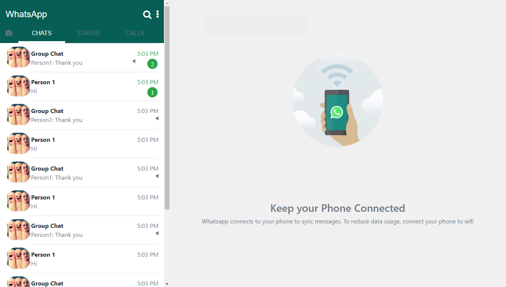
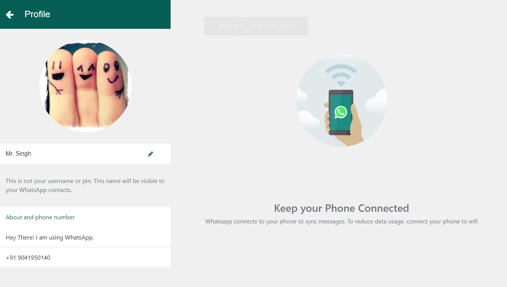
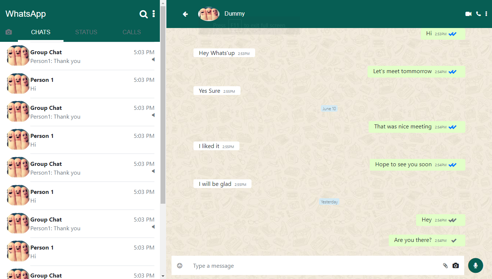

# Whatsapp Clone

This is dummy HTML view of whatsapp which is responsive in nature and is created using twitter bootstrap. On Desktop, view will be similar to web whatsapp while on mobile it will be similar to whatsapp android app.

[Click here](https://sharan3009.github.io/whatsapp-clone) to check the contact list page. 
[Click here](https://sharan3009.github.io/whatsapp-clone/unread.html) to check the contact list including unread messages. 
[Click here](https://sharan3009.github.io/whatsapp-clone/profile.html) to check the profile page to change display picture. 
[Click here](https://sharan3009.github.io/whatsapp-clone/chat.html) to check the personal chat page. 

### Screenshot

### Built With
* HTML5
* CSS3
* Bootstrap